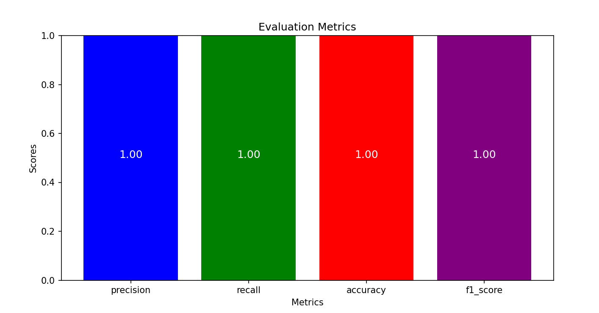

# Contract Parsing and Integration with Zenskar API

## Project Overview

This project automates the extraction, validation, and transformation of key fields from contract documents using large language models (LLMs). The goal is to parse unstructured contract data and extract important details like contract IDs, dates, customer names, payment terms, and other metadata.

### What It Does:

1. **Contract Parsing using LLMs and Dynamic Prompts:**  
   The project uses large language models (e.g., GPT-4) to extract key contract details. Custom prompts guide the model in identifying fields like contract ID, customer name, contract dates, payment terms, contract amount, and metadata.

2. **Hybrid Approach for Data Validation:**  
   Combines the flexibility of LLMs for understanding context and extracting unstructured data, with deterministic methods like regex and NLP techniques for validation.

3. **Data Transformation and Integration:**  
   Validated contract data is integrated with the Zenskar Contract API for further processing and storage.  
   **Note:** Zenskar requires an organization account to generate an API key, so this part of the code is non-functional without one.

## Project File Structure and Description

### Directories

1. **`Contracts_Highlighted/`**  
   Stores PDF contracts with overlays highlighting the extracted text.

2. **`Contracts/`**  
   Contains all raw contract PDFs for processing.

3. **`Contracts_JSON/`**  
   Holds JSON files of the extracted and validated contract data.

4. **`Contracts_Txt/`**  
   Contains text files extracted from the PDFs, created by the `pdf2txt.py` script.

### Files

1. **`main.py`**  
   Main entry point for executing the code. Run with `python run main.py`.

2. **`pdf2txt.py`**  
   Converts PDF files to text. Calls `ocr.py` as a fallback for scanned PDFs.

3. **`ocr.py`**  
   Fallback script for extracting text using OCR when PDF conversion fails.

4. **`Extraction.py`**  
   Extracts structured data from text using LLMs with dynamic prompts.

5. **`regex_nlp_validation.py`**  
   Validates extracted data using regex and NLP techniques.

6. **`json_to_pdf.py`**  
   Overlays extracted text onto PDFs, saving highlighted versions.

7. **`send_to_zenskar.py`**  
   Sends validated JSON data to the Zenskar Contract API.

8. **`evaluation_metrics.py`**  
   Evaluates the extraction performance with precision, recall, accuracy, and F1 score.

## Tools Used

- **GPT-4** (gpt-4o-mini)
- **SpaCy** for NLP tasks
- **Matplotlib** and **Scikit-Learn** for plotting evaluation metrics
- **Dynamic Prompts** for flexible LLM queries



## Installation Instructions

To set up the project, follow these steps:


```bash
### 1. Clone the repository
git clone https://github.com/shubhangi-mish/Smart-Contract-Extraction-with-AI.git
cd <project_directory>'''

## Installation Guide

To set up the project and run it locally, follow the steps below:

### 2. Create a Virtual Environment

It's highly recommended to use a virtual environment to isolate your dependencies. You can create and activate one using the following commands:

#### On Windows:
python -m venv venv
.\venv\Scripts\activate

<<<<<<< HEAD
```bash
python main.py
=======
### 3. Install Requirements.txt
### 4. Run the main.py


Voila!!!
>>>>>>> 614a4d0f702f90d34e53dc4f4e37ba55e5adf98d

The dynamic prompts used in the project are designed to extract specific contract details, including but not limited to the following:

- Contract ID
- Customer Name
- Contract Dates (Start and End)
- Payment Terms
- Contract Amount
- Other Metadata

These prompts are dynamic in nature, adapting to the structure and context of the contract text. The prompts are carefully crafted to guide the LLM in identifying the relevant fields based on the contract's content.

Example of a dynamic prompt:
```plaintext
Like the prompt for extracting the Contract ID: which is not explictly mentioned so the llm found the SOW which is similar to the required data and unique
    prompt = f"Extract the contract ID from the following text and only give the ID if nothing give none.\n\n{order_form_text}"
    Response=
        "extracted_value": "SOW-CFCU-WCOBCMC-2023",
        "reasoning": "The extracted contract ID is SOW-CFCU-WCOBCMC-2023, identified in the services description for Product A, indicating the specific statement of work referenced in the order form.",
        "confidence": "0.8"


Comparsion between my approach and feeding file directly to LLM

## Key Differences

| **Aspect**                      | **Text to LLM + NLP + Regex**                       | **PDF to LLM**                             |
|----------------------------------|-----------------------------------------------------|----------------------------------------------|
| **Extraction Process**           | Involves multiple steps (text extraction, NLP, regex) | Directly processes the entire document in one step |
| **Output Structure**             | Structured with explicit reasoning and confidence scores | Informal summary with key details highlighted |
| **Customization**                | Highly customizable (can fine-tune regex, NLP models) | Less customizable, depends on LLM's inference |
| **Transparency**                 | High transparency with detailed reasoning and confidence scores | Less transparency (no reasoning or confidence scores) |
| **Speed**                        | Slower due to multiple steps                        | Faster due to simplicity (single LLM pass)    |
| **Complexity**                   | More complex, requires setup of multiple components | Simpler, relies only on LLM's inference capabilities |
| **Resource Usage**               | More resource-intensive (multiple steps, models)    | Less resource-intensive (one LLM pass)       |
